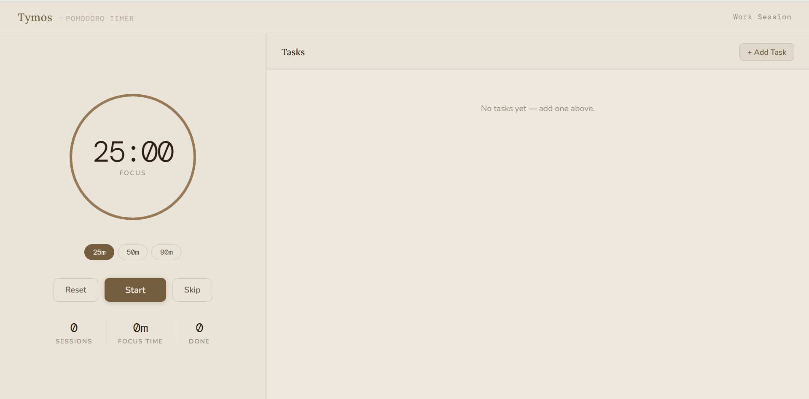

# Tymos

> A minimal, distraction-free focus timer — built around the ritual of a burning candle.

**Live →** https://jayden2610.github.io/tymos/



---

## What it does

Tymos pairs a Pomodoro-style timer with a simple task list. Each focus session burns down a candle. Complete a session, earn the candle. It makes focused work feel tangible.

- **Timer presets** — 25 / 50 / 90 min focus + configurable breaks
- **Task cards** — priority levels, sub-tasks, notes, estimated sessions
- **Candle system** — candle burns as you work; earns a spot on your shelf when done
- **Stats** — daily focus log, streak tracking, session history
- **Spotify integration** — connect and control music without leaving the app
- **Persistence** — tasks and stats saved locally (+ Supabase sync when signed in)
- **Keyboard-first** — Space to start/pause, full keyboard nav
- **Mobile responsive**

---

## Run locally

```bash
python -m http.server 8080
# open http://localhost:8080
```

## Deploy

Push to `master` → GitHub Pages auto-deploys in ~30 seconds.

---

Built with vanilla JS, no build step, no dependencies.

