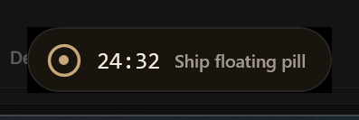

# Pill transparency investigation — findings & constraints

Goal: capsule-shaped floating pill (`border-radius: 999px` per the mock) with the
desktop visible through the corners — no border/halo band around it.

Status as of this branch: **capsule shape + per-pixel transparency DONE.**
The capsule renders over a fully transparent window — the desktop shows through
the rounded-off corners with no band. This file records what was tried, what
works, what is inert, and what crashed, so nobody re-runs the same experiments.

## The core constraint

The pill is a **WinUI 3 (DirectComposition) window**, not HTML — there is no CSS
layer. On a DComp window:

- The XAML surface has an alpha channel, **but DWM composites the window as an
  opaque rectangle** unless the window is on a special alpha path.
- Where the XAML paints nothing (the capsule's rounded-off corners), the
  compositor fills the window with its **opaque default background** — that is
  the band.
- `CornerRadius` in XAML only shapes *painted* content; it cannot punch holes in
  the window itself.

## What was tried (results)

| # | Mechanism | Result |
|---|-----------|--------|
| 1 | `DWMWA_CORNER_PREFERENCE = ROUND` | Rounds the **window rect** at the fixed system radius (~10px) — not the capsule radius. Cosmetically wrong for a pill; kept as cosmetic-only. |
| 2 | `SetLayeredWindowAttributes` color key (`LWA_COLORKEY`) | **Inert.** The keyed black band still rendered. Legacy layered attributes do not apply to DComp/XAML content. |
| 3 | `SetWindowRgn` capsule region | **Reported but not honored.** `GetWindowRgn` returns the correct complex region, yet the full rect still renders (proved by painting the root magenta — the band turned magenta). |
| 4 | `WS_EX_LAYERED` + `LWA_COLORKEY` | Same as #2 — inert, and it also blocks #3. |
| 5 | Custom `SystemBackdrop` subclass + `Window.SystemBackdrop = ...` | **Crashes** WASDK 1.6 during the first compositor commit (combase `0x80131523`, InvalidOperationException), even when `OnTargetConnected` assigns a valid brush. Do not use the property route with a custom backdrop. |
| 6 | Direct interop brush: `window.As<ICompositionSupportsSystemBackdrop>().SystemBackdrop = transparentBrush` | **Works and is safe** (see `MainWindow.ConfigureWindow`). The band changes from the theme gray to pure black — the brush is honored, but the window is still composited opaquely. Requires a `Windows.System.DispatcherQueue` on the UI thread (see below). |
| 7 | `DwmEnableBlurBehindWindow` (empty region) + `DwmExtendFrameIntoClientArea(0)` — the classic DComp per-pixel-alpha path, used by WinUIEx `TransparentTintBackdrop` | **Works — this is the fix.** Naively it crashed (combase `0x80131523`); the crash was ordering/hook-related, not fundamental. Replicating WinUIEx's exact recipe (see "Resolution") makes it stable. |
| 8 | GDI `FillRect(black)` on the window DC (alpha-0 base, WinUIEx's `ClearBackground`) | Safe (no crash). Alone it does not enable alpha — kept as part of the recipe for #7. |
| 9 | Accent policy `ACCENT_ENABLE_TRANSPARENTGRADIENT` (color 0) — the TranslucentTB/TaskbarX trick | No visible effect on this window. |
| 10 | `DWMWA_NCRENDERING_POLICY = DISABLED`, `DWMWA_SYSTEMBACKDROP_TYPE = NONE` | No visible effect (kept; harmless). |

## The DispatcherQueue trap

Creating the `Windows.UI.Composition.Compositor` (needed for the backdrop brush
seam) throws *"The caller must initialize DispatcherQueue on this thread"*. The
WinUI `Microsoft.UI.Dispatching` queue does **not** count, and
`Windows.System.DispatcherQueueController.CreateOnCurrentThread()` is missing
from the .NET projection. Working fix (same as WinUIEx): P/Invoke
**`CoreMessaging.dll!CreateDispatcherQueueController`** with
`DQTYPE_THREAD_CURRENT` + `DQTAT_COM_STA` — see
`TransparentBackdrop.EnsureWindowsDispatcherQueue()`.

## Resolution (per-pixel transparency shipped)

The blur-behind crash (#7) was **ordering/hook-related, not fundamental**. WinUIEx's
`TransparentTintBackdrop` does three things the old direct-interop route skipped:

1. Hooks `WM_ERASEBKGND` and fills the client black every time (GDI 32bpp leaves
   the alpha byte at 0) and returns 1 = handled — a message-loop hook, not a
   one-shot + on-resize fill.
2. Re-applies the DWM blur-behind config on `WM_DWMCOMPOSITIONCHANGED` (798).
3. Runs `DwmExtendFrameIntoClientArea(0)` + `DwmEnableBlurBehindWindow(empty rgn)`
   inside `SystemBackdrop.OnTargetConnected`, *before* the brush is assigned,
   then clears the surface via `GetDC` at connect time.

Implemented as `PillTransparentBackdrop` (a `Microsoft.UI.Xaml.Media.SystemBackdrop`
subclass), assigned via `Window.SystemBackdrop` in `MainWindow.ConfigureWindow`.
The Win32 `WindowMessageMonitor` equivalent is a `SetWindowLongPtr(GWLP_WNDPROC)`
subclass with the delegate pinned (GC). On by default; `--no-alpha` falls back to
the legacy opaque path.

Verified over a white background: corners read white (desktop through), capsule
body reads ~(50,45,40) (glass over white), survives pause/resume, drag, and the
per-tick refit. No crash.

Fallback paths (unused, kept for reference if blur-behind ever regresses):
`UpdateLayeredWindow` with a rendered ARGB bitmap (abandons XAML rendering), or
an island rehost on a self-created `WS_EX_NOREDIRECTIONBITMAP` window +
`DesktopWindowTarget` (biggest change, full surface-alpha control).

## Related fix in this branch (unrelated to visuals)

The bridge (`StateServer`) was rewritten from `HttpListener` to a raw
`TcpListener` on loopback: `HttpListener` requires a URL ACL for
`http://127.0.0.1:17865/` when the process is not elevated — without one the
bridge silently failed and the pill froze on its sample state. The TcpListener
version needs no elevation and no ACL.
